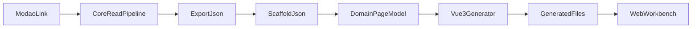

# Architecture

`modao-prototype-reader` is now organized as a local development tool with three major layers:

- `src/core`
  - Modao reading, extraction, diagnostics, and artifact building
- `src/domain`
  - intermediate page models derived from scaffold-like data
- `src/generators` and `src/templates`
  - code generation for target frameworks, currently focused on Vue 3

Supporting layers:

- `src/pipelines`
  - connect artifact inputs to generators
- `src/cli`
  - command entrypoints
- `src/server`
  - local HTTP API
- `src/web`
  - browser workbench for read, analyze, and generate flows

## Flow

## Boundaries

- `core` should not become a dumping ground for framework-specific generation
- generators should consume scaffold-like or domain-level data, not raw browser runtime objects
- the web workbench should orchestrate flows, not own artifact transformation rules
